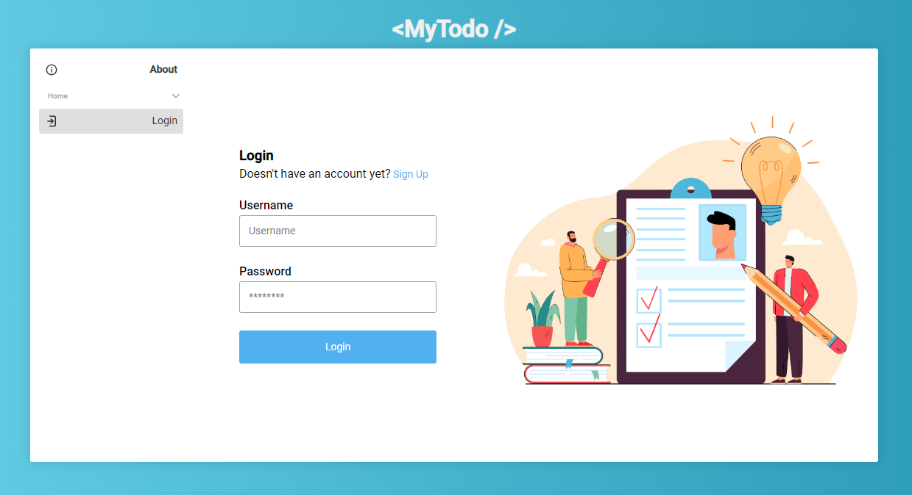
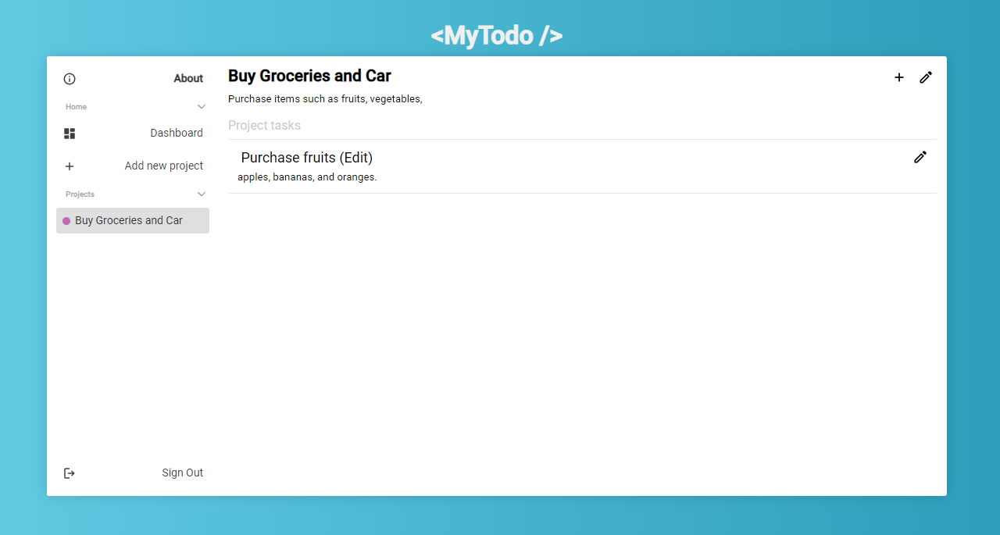

# Application MyTodo

> **Note**
>This application was created by me as a **pet project** for practice.

The project is a simple TODO application, that should help you to
create structured plan to achieve your goals.

## Project structure
```bash
|
|_client
|_server
|_images (used in README only)
|_docker-compose.yml
|_.gitignore
```

There are 2 main folders that make up entire project.
- `client` folder contains front-end part of an app, written in **React**, using **TypeScript**.
- `server` folder contains back-end, simple API, which is made in **Python**, **Django** framework in combination with **Django REST**. (SQLite3 only)
- Also, the project is using Docker.

## Usage

> **Note**
>You will need docker, if you want to start this application quick.

**If you have docker:**

To start the project up, run
```bash
docker-compose up
```

This should create 2 containers for front-end and back-end. 
Your front-end should be accessible at `http://localhost:3000/`, while back-end at `http://localhost:8000/`.

To end process, run
```bash
docker-compose down
```

**If you don't have docker:**

For the front-end you should have **node** installed.

First, you have to install all the dependencies. For that go into client folder and run there:
```bash
npm install
```

Then you should be able to start React like so:
```bash
npm start
```

For the back-end you will need python and pip, obviously.

The same as it was in front-end - install all the dependencies. Go into server folder and run:
```bash
pip install -r ./requirements.txt
```

After that you should make migrations in order to create database out of models from Django. Run:
```bash
python manage.py makemigrations
```
and then run:
```bash
python manage.py migrate
```

At this point you are ready to start up the server. Run:
```bash
python manage.py runserver
```

## Screenshots



## Project Summary

As I mentioned earlier, this is a pet project. 

The goal was to practice **Django**, **Django REST**, **Testing in Django**, **Token authorization**. I should also include here **Docker** with **Docker-compose**. I managed to create fullstack application, dockerize each part, create its own network and connect everything, so it works nicely.